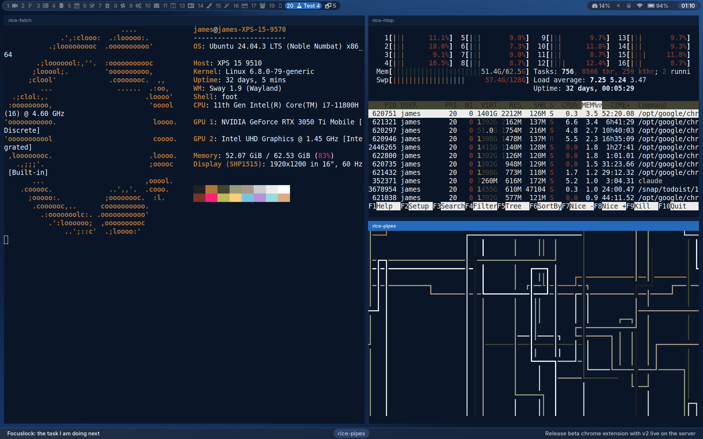
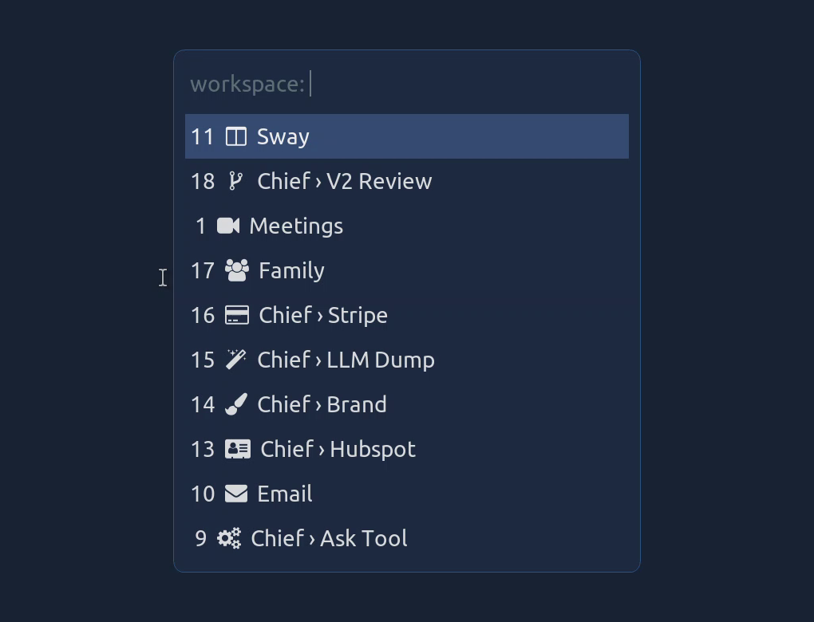
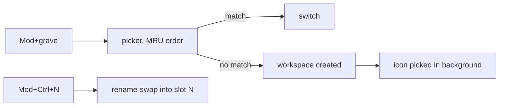
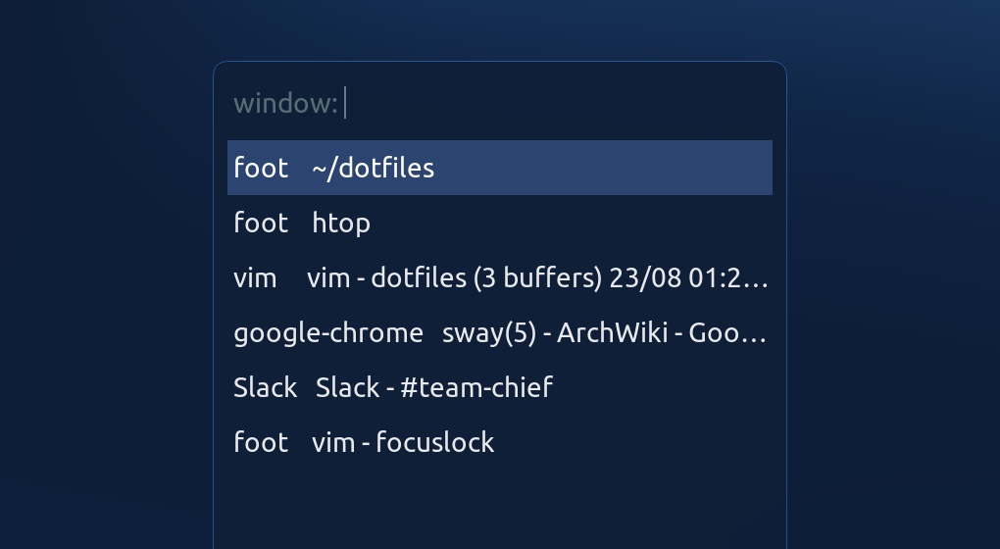
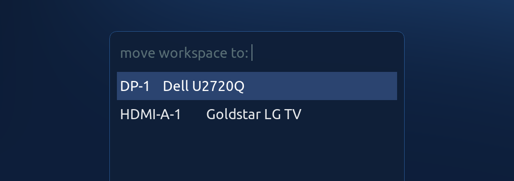
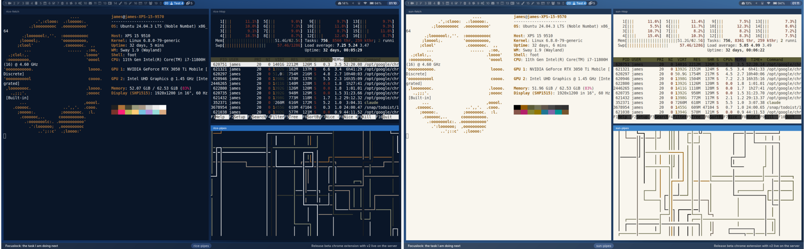
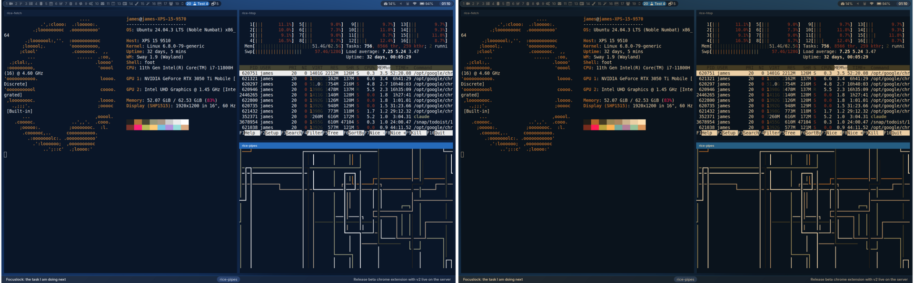
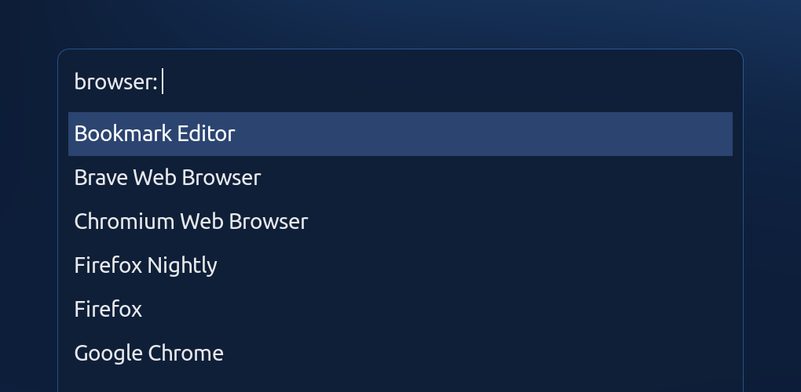
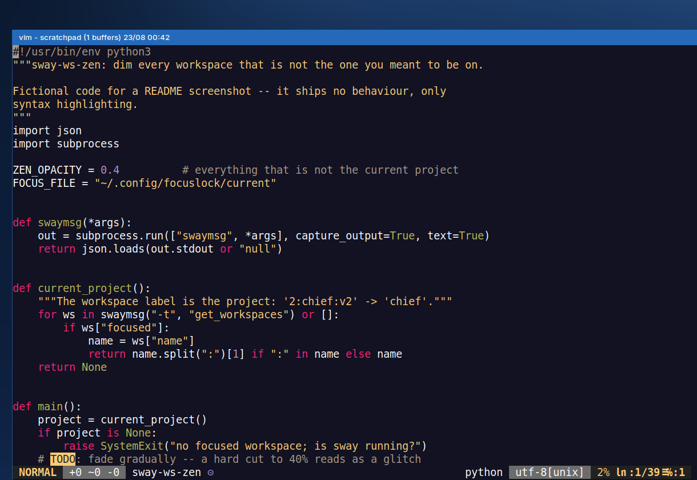

# dotfiles

Configuration for a sway desktop on Ubuntu: window manager, bars, terminals,
vim, and the system files that keep a Dell XPS suspending, resuming, and
staying audible. Workspaces are named after projects and reached by typing;
the number keys hold whatever is active right now.



Design decisions are recorded in the commit messages. `git log` explains why
a thing is the way it is; this file describes what is here and how to use it.

## Contents

- [Installation](#installation)
- [Keyboard reference](#keyboard-reference)
- [Workspaces](#workspaces)
- [Bars](#bars)
- [FocusLock](#focuslock)
- [Window switcher](#window-switcher)
- [Terminal](#terminal)
- [Sunlight mode](#sunlight-mode)
- [Night light](#night-light)
- [Screenshots and recording](#screenshots-and-recording)
- [Default browser menu](#default-browser-menu)
- [Vim](#vim)
- [Hardware and system fixes](#hardware-and-system-fixes)

## Installation

Files deploy as **hard links**: the file in the repo and the file the program
reads are the same inode, so an edit on either side is live on both.

- [LINKS](LINKS) lists the `ln` command for every file, including the
  `sudo` ones for `/etc` and `/usr/share`.
- Enable the secret scanner once per clone:
  `git config core.hooksPath githooks`. The
  [pre-commit hook](githooks/pre-commit) runs gitleaks on staged changes.
- Caution: `git rebase` replaces files and silently severs their links.
  After history edits, verify with `ls -l` that link counts are still 2,
  and re-link with `ln -f` where they are not.

## Keyboard reference

`Mod` is the Super key. Bindings are defined in [sway/config](sway/config).

| Keys | Action |
| --- | --- |
| Mod+grave, Mod+backslash | Open the workspace picker. Typing an unknown name creates that workspace. |
| Mod+Shift+grave | Send the focused window to a picked workspace. |
| Mod+n | Rename the current workspace, keeping its number. |
| Mod+Ctrl+1…0 | Swap the current workspace into slot 1–10. |
| Mod+Alt+Ctrl+1…0 | Swap the current workspace into slot 11–20. |
| Mod+1…0, Mod+Alt+1…0 | Switch to slot 1–20. |
| Mod+Shift+1…0 | Send the focused window to slot 1–10. |
| Mod+Tab | Search all window titles and focus the match. |
| Mod+Shift+w | Move the workspace to a picked monitor. |
| Mod+Alt+w | Move the workspace to the next monitor. |
| Mod+Shift+t | Float the window at 98% of the workspace; Mod+t returns it. |
| Mod+Shift+d | Toggle sunlight mode. |
| Mod+d | Toggle night light. |
| Print | Freeze the screen, select a region, save it. |
| Ctrl+Print | Freeze, select, copy to the clipboard. |
| Alt+Print | Capture every monitor. |
| Ctrl+Alt+Print | Select from the live, unfrozen screen. |
| Shift+Print | Record a region as H.264 video. |
| Mod+Alt+c | Pick a pixel, copy its hex colour. |
| Mod+Shift+f | Edit the FocusLock task file in vim. |

## Workspaces

Twenty number keys cannot address thirty-five projects. These scripts make
the workspace *name* the address and the numbers a cache of current work.



A 50-second tour — creating a workspace by typing its name, sending a
window the same way, promoting into slot 2, renaming, and the icon
arriving on its own:

https://github.com/user-attachments/assets/ff0909d8-9827-4132-ba4e-48abefaba02b

The canonical copy lives in the repo at
[screenshots/workspace-tour.mp4](https://raw.githubusercontent.com/Jamedjo/dotfiles/master/screenshots/workspace-tour.mp4),
re-recordable with [record-workspace-tour.sh](screenshots/record-workspace-tour.sh).

- **Switch by typing.** Mod+grave lists workspaces most-recently-used
  first; two or three letters select a project.
- **Create by typing.** A name that matches nothing becomes a new
  workspace, so starting a project and switching to it are one action.
- **Keep the hot slots.** Mod+Ctrl+N pulls the current workspace into
  slot N and gives its number to the displaced one. The swap is a rename:
  no window moves, and `workspace number N` bindings keep working.
- **Park the rest.** Workspaces without a claimed slot number sit at 11+,
  still reachable with Mod+Alt+N.
- **Survive restarts.** A daemon records number→name pairs and restores a
  name when sway recreates that workspace. It never overwrites a name you
  just set.
- **Icons appear on their own.** When a workspace gains a name, a
  background job picks a bar icon for it with a small LLM call. The model
  chooses from glyph *names* extracted from the bar font itself and its
  answer is rejected unless it is on that list, because models asked for
  raw codepoints return glyphs that draw something else.



Files: [sway/scripts](sway/scripts) (`sway-ws-switch`, `sway-ws-move`,
`sway-ws-promote`, `sway-ws-rename`, `sway-ws-mru`, `sway-ws-names`,
`sway-ws-icon`, shared logic in `sway-ws-lib`).

Each workspace also remembers its working directory: a
[zsh plugin](sway-workspace-dirs/sway-workspace-dirs.plugin.zsh) saves
`$PWD` per workspace name on every `cd`, and new shells start where that
workspace last was.

## Bars

Two waybar bars frame the screen; config in [waybar/](waybar).


- **Top: state.** Workspaces, mode, scratchpad on the left; system
  readouts, tray and clock on the right. Each workspace button shows its
  number and an icon; the focused one also shows its name. CPU is the face
  of a hover drawer that slides out memory and temperature.
- **Bottom: intent.** One task you chose, the focused window's title, and
  the team's top priority — see [FocusLock](#focuslock).

## FocusLock

The bottom bar keeps the one task you decided to do on screen at all
times, beside the title of the window you are actually in.


- **Recover from interruptions.** After a call, a Slack thread, or a
  compile wait, the bar re-states what you were doing; you resume instead
  of re-planning.
- **Choose one thing.** Writing the line forces picking a single next
  action out of a hundred-item backlog; the tooltip queues the next few.
- **See drift.** The window title sits next to the task, so "is this
  window that task?" is answered at a glance.
- **Never open the todo app.** Glancing at the bar is free; opening a
  task manager is a context switch with its own rabbit holes.

Two interchangeable sources feed it:

- **A plain text file** — the first line of
  `~/.config/focuslock/current` is the task, the lines below are the
  queue. Mod+Shift+f opens it in vim; capturing a thought is one edit.
  Rendered by [focuslock-module.rb](waybar/focuslock-module.rb).
- **A Todoist filter** — the top task of a project's `/Focus` section,
  polled through `todoist-cli` by
  [todoist-module.rb](waybar/todoist-module.rb), so a priority shared
  with a team stays in the shared tool and on your screen.

## Window switcher

Mod+Tab fuzzy-searches every window title on every workspace and focuses
the match — an Alt-Tab that scales past the point where cycling stops
working.



- The whole switcher is a single `bindsym` pipeline in
  [sway/config](sway/config): `swaymsg -t get_tree | jq | fuzzel | awk |
  swaymsg focus`.
- The comments around it document the traps: sway splits a binding on any
  unquoted semicolon and feeds the rest to its own parser, fuzzel has no
  `--with-nth`, and nothing validates the command until the key is
  pressed.
- The window list is written to `$XDG_RUNTIME_DIR`, not `/tmp`, so window
  titles are not world-readable.

The same menu pattern moves workspaces between monitors: Mod+Shift+w
lists the other outputs and sends the current workspace to the one you
pick.



## Terminal

[foot](foot/foot.ini), with:

- one million lines of scrollback,
- the desktop's navy background, set once in `[colors]`,
- a shell title of the current directory, so the window switcher can tell
  terminals apart.

## Sunlight mode

Direct sun sets a glare floor brighter than a dark theme's background, so
outdoors the screen goes dark-on-light instead. Mod+Shift+d toggles it;
[sway-sunlight](sway/scripts/sway-sunlight) implements it.



- Every *running* foot terminal has its palette rewritten in place: the
  script writes
  OSC 4/10/11 colour escapes to each terminal's pty, so nothing restarts
  and nothing inside a terminal is lost.
- Everything that is not a terminal gets a global midtone lift through the
  GPU's gamma table (`wl-gammactl`).
- True inversion is impossible at that layer — the DRM gamma table must be
  non-decreasing — which is why terminals are re-coloured individually
  rather than the whole screen being flipped.
- Toggling off resets the palettes (OSC 104/110/111 return to `foot.ini`)
  and restarts night light.
- OSC reaches only the 16-colour palette. TUIs that draw 24-bit colour
  pick their own theme: ones that detect the background do so at startup,
  so they adapt when launched under sunlight mode, but a session that
  started dark keeps its dark colours until its theme is switched by hand.
- The right half of the image is a composite: palette-switched terminals
  are captured directly, but gamma changes apply at scanout and do not
  appear in screen captures, so the midtone lift is reproduced on the
  image.

## Night light

[wlsunset](sway/config) warms the screen on the local sunset schedule.
Mod+d toggles it via SIGUSR1.



The warm half is simulated for the same reason as above: gamma ramps do
not appear in screen captures.

## Screenshots and recording

- **Print** freezes the screen first, then crops out of the still — menus,
  hovers and anything else that dies on focus loss survive selection
  (`cropshot`). Modifier variants copy, capture all monitors, or skip the
  freeze; see the [keyboard reference](#keyboard-reference).
- **Shift+Print** records a region with
  [screencap_tray.py](Scripts/screencap_tray.py): hardware H.264 4:2:0 on
  the Intel iGPU, chosen because the software default (yuv444p) does not
  play on phone decoders. A tray icon stops the recording.
- **Mod+Alt+c** copies the hex value of any pixel:
  slurp → grim → ImageMagick → `wl-copy`.
- Captures land in `XDG_SCREENSHOTS_DIR`, set in
  [user-dirs.dirs](user-dirs.dirs).

## Default browser menu

With hundreds of tabs open in one browser, a clicked link must not wake the
wrong one. The system default browser is therefore
[a menu](browser-chooser.sh): every `xdg-open` of a URL shows a fuzzel list
of installed browsers, discovered from their `.desktop` files.



Registering a script as the default browser is not obvious. The commands
are in the script header; in short:

```sh
sudo update-alternatives --install /usr/bin/x-www-browser x-www-browser ~/browser-chooser.sh 200
sudo update-alternatives --install /usr/bin/gnome-www-browser gnome-www-browser ~/browser-chooser.sh 200
xdg-settings get default-web-browser   # verify what xdg-open resolved
```

## Vim

[.vimrc](.vimrc), arranged around fast navigation in large repos:

| Keys | Action |
| --- | --- |
| Ctrl+P | Fuzzy-open files (rg file list, so gitignore is respected). |
| \b, \l, \m, \c, \h | FZF over buffers, lines, marks, commits, history. |
| \g | FZF over files modified in git. |
| Ctrl+Shift+F | Project-wide search into a side window (vim-grepper). |
| Home / End | Previous / next quickfix result. |
| Ctrl+G | FZF over ctags (gutentags; node_modules excluded). |
| Ctrl+N | Multiple cursors on the next occurrence. |
| Ctrl+K Ctrl+K | Copy the file's path to the Wayland clipboard. |

- ALE runs `tsc` and the project's eslint, and provides completion.
- The titlebar shows project directory and buffer count
  (`vim - dotfiles (3 buffers)`), which is what Mod+Tab matches on.
- The [jamedjo colourscheme](jamedjo.vim) styles on top of the terminal's
  16 colours rather than defining its own, so vim follows whatever palette
  the terminal wears — including sunlight mode. Shown here on the
  [.Xresources](.Xresources) palette it was written against:



## Hardware and system fixes

Tracked system files, each the result of a diagnosis recorded in its
commit:

- **Hibernation** on an XPS with a swapfile: resume offset in
  [grub](grub), `resume=UUID=` (a bare UUID silently fails), and a
  [polkit override](com.ubuntu.enable-hibernate.pkla) because Ubuntu
  reports `CanHibernate=no` and otherwise force-shuts-down at 6% battery.
- **Lid close** does suspend-then-hibernate
  ([sleep.conf](sleep.conf), [logind.conf](logind.conf)), so a laptop left
  shut for days does not drain flat.
- **Audio**: PulseAudio path files pin the XPS internal mic's gain below
  its static threshold and prefer a plugged headset mic
  ([analog-input-internal-mic.conf](analog-input-internal-mic.conf)).
- **Third monitor**: `WLR_DRM_NO_MODIFIERS=1` in [sway.sh](sway.sh) keeps
  three outputs inside Intel's bandwidth limits.
- **File limits**: [limits.conf](limits.conf) raises `nofile`; Firefox
  plus many windows could crash sway at the default 1024.
- **Gestures**: three-finger swipes switch workspaces
  ([libinput-gestures.conf](libinput-gestures.conf)).
- **Near-fullscreen** (Mod+Shift+t) floats a window at 98% of the
  workspace: the app is never told it is fullscreen, so Chrome keeps its
  tab strip, and the visible margin shows the stack behind.
- **Waybar restarts alone**: launched by `exec_always`, not
  `swaybar_command`, so the bar reloads without reloading sway.
